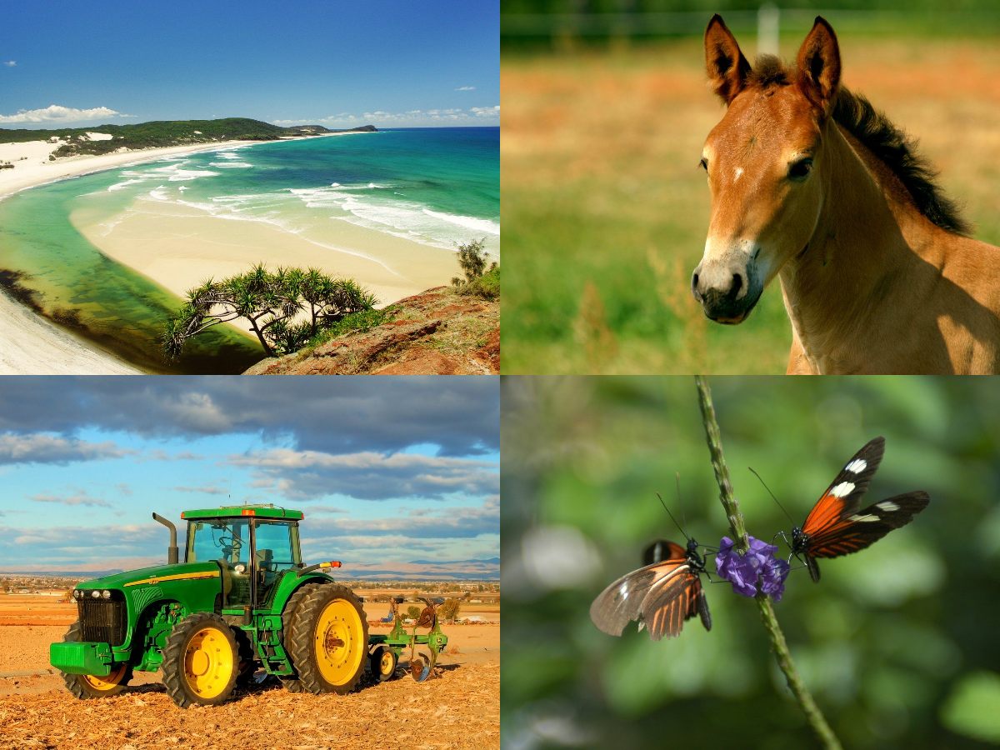

# AutoCropCollage
A python package to split image collages. This step is crucial while creating training dataset for image based machine learning projects from training images stiched in a collage. This package uses OpenCV, Numpy and Scipy to detect image boundaries within the collage, filter the relevant ones and uses them to split it. Although this may not be directly usable for tiled collage with varying image sizes, but the underlying idea can still be implemented. Please refer to AutoCropCollage.ipynb for more details about usage.

  

  

